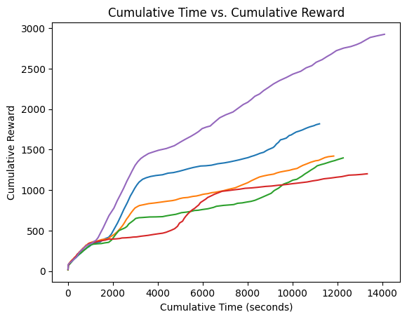

# Apply Edge pop up algorithm(SLTH) to DQN

## Overview
This repository contains a model that prunes Deep Q-Network (DQN) models by Edge pop up algorithm. The goal of this approach is to reduce the computational complexity of DQN models while maintaining or even enhancing their performance in playing Atari games.

## Work In Progress (WIP)
Please note that this repository is a work in progress. Tuning of hyperparameters is needed to optimize the model's performance. As evident from the performance chart in Performance section below, there is a noticeable difference in rewards between the pruned and non-pruned models.

## Performance
1. Pruning Effectiveness: The performance of the pruned model is relatively lower compared to the non-pruned model, as shown in the following chart. The chart illustrates the reward over episodes, highlighting the impact of pruning on the model's ability to play the game. 

<table>
  <tr>
    <!-- Pruned Model vs  Non-Pruned Model-->
    <td>
      <figure>
        
        <figcaption>Fig.1 - Pruned Model vs  Non-Pruned Model Performance</figcaption>
      </figure>
    </td>
  </tr>
</table>

3. Pruning Processing Time: When pruning is applied, it takes relatively longer for the model to achieve a certain level of performance. This is depicted in the two charts below, where the first shows the progress of the pruned model and the second displays the progress of the non-pruned model over the same number of episodes.

<table>
  <tr>
    <!-- Pruned Model Chart -->
    <td>
      <figure>
        
        <figcaption>Fig.2 - Pruned Model Performance</figcaption>
      </figure>
    </td>
    <!-- Non-Pruned Model Chart -->
    <td>
      <figure>
        
        <figcaption>Fig.3 - Non-Pruned Model Performance</figcaption>
      </figure>
    </td>
  </tr>
</table>


## Execution Instructions
To run the model training with pruning, follow these steps:

1. Install the necessary dependencies using poetry:
```bash
poetry install
```

2. Execute the bash script with the specified arguments:
```bash
.sh scipt/is_prune/{}.sh
```

The content of the bash script is as follows:

```bash
#!/bin/bash

n_episodes=300
max_seed=5
remain_rate=0.3
env_id="PongNoFrameskip-v4"

poetry run python src/tools/is_prune/train.py \
    --n_episodes $n_episodes \
    --max_seed $max_seed \
    --remain_rate $remain_rate \
    --env_id $env_id
```
